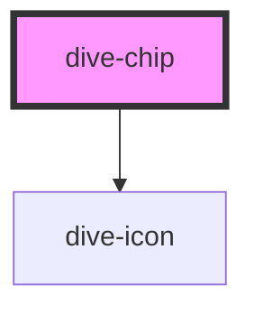

# dive-chip

Interactive pill-shaped chips for selections, filters, and status indicators.

## Usage

```html
<!-- Basic usage -->
<dive-chip text="Default Chip"></dive-chip>

<!-- Outline variants (default) -->
<dive-chip type="primary" variant="outline" text="Primary Outline"></dive-chip>
<dive-chip type="success" variant="outline" text="Success Outline"></dive-chip>
<dive-chip type="warning" variant="outline" text="Warning Outline"></dive-chip>
<dive-chip type="error" variant="outline" text="Error Outline"></dive-chip>
<dive-chip type="info" variant="outline" text="Info Outline"></dive-chip>

<!-- Filled variants -->
<dive-chip type="primary" variant="filled" text="Primary Filled"></dive-chip>
<dive-chip type="success" variant="filled" text="Success Filled"></dive-chip>
<dive-chip type="warning" variant="filled" text="Warning Filled"></dive-chip>
<dive-chip type="error" variant="filled" text="Error Filled"></dive-chip>
<dive-chip type="info" variant="filled" text="Info Filled"></dive-chip>

<!-- Disabled state -->
<dive-chip type="primary" variant="outline" text="Disabled Outline" disabled></dive-chip>
<dive-chip type="primary" variant="filled" text="Disabled Filled" disabled></dive-chip>
```

## Properties

| Property | Attribute | Description | Type | Default |
| -------- | --------- | ----------- | ---- | ------- |
| `disabled` | `disabled` | Whether the chip is disabled | `boolean` | `false` |
| `text` | `text` | The text content of the chip | `string` | `''` |
| `type` | `type` | The semantic variant of the chip | `"base" \| "error" \| "info" \| "primary" \| "success" \| "warning"` | `'base'` |

## CSS Custom Properties

The chip component uses CSS custom properties from the design system for consistent theming across light, dark, and high-contrast modes.

<!-- Auto Generated Below -->


## Properties

| Property    | Attribute   | Description | Type                                                                 | Default     |
| ----------- | ----------- | ----------- | -------------------------------------------------------------------- | ----------- |
| `clickable` | `clickable` |             | `boolean`                                                            | `true`      |
| `disabled`  | `disabled`  |             | `boolean`                                                            | `false`     |
| `icon`      | `icon`      |             | `string \| undefined`                                                | `undefined` |
| `iconOnly`  | `icon-only` |             | `boolean`                                                            | `false`     |
| `removable` | `removable` |             | `boolean`                                                            | `false`     |
| `size`      | `size`      |             | `"large" \| "medium" \| "small"`                                     | `'medium'`  |
| `text`      | `text`      |             | `string`                                                             | `''`        |
| `type`      | `type`      |             | `"base" \| "error" \| "info" \| "primary" \| "success" \| "warning"` | `'base'`    |
| `variant`   | `variant`   |             | `"filled" \| "outline"`                                              | `'outline'` |


## Events

| Event        | Description | Type                |
| ------------ | ----------- | ------------------- |
| `chipClick`  |             | `CustomEvent<void>` |
| `chipRemove` |             | `CustomEvent<void>` |


## Dependencies

### Depends on

- [dive-icon](../Icon)

### Graph


----------------------------------------------

*Built with [StencilJS](https://stenciljs.com/)*
