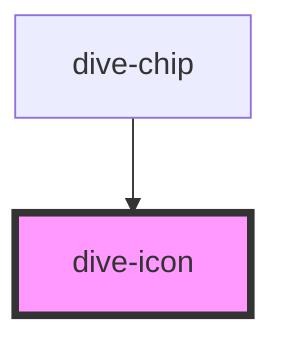

# dive-icon

<!-- Auto Generated Below -->

## Properties

| Property            | Attribute      | Description | Type                             | Default     |
| ------------------- | -------------- | ----------- | -------------------------------- | ----------- |
| `color`             | `color`        |             | `string \| undefined`            | `undefined` |
| `name` _(required)_ | `name`         |             | `string`                         | `undefined` |
| `size`              | `size`         |             | `"large" \| "medium" \| "small"` | `'medium'`  |
| `strokeWidth`       | `stroke-width` |             | `number`                         | `2`         |
| `variant`           | `variant`      |             | `"filled" \| "outline"`          | `'outline'` |

## Dependencies

### Used by

 - [dive-chip](../Chip)

### Graph

----------------------------------------------

*Built with [StencilJS](https://stenciljs.com/)*
